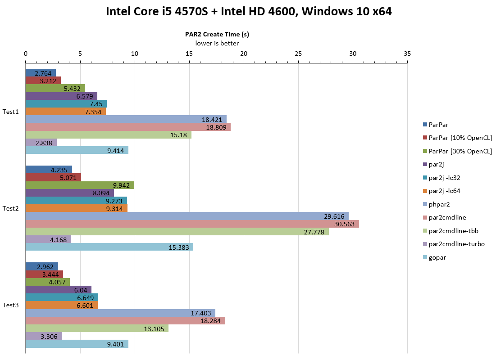
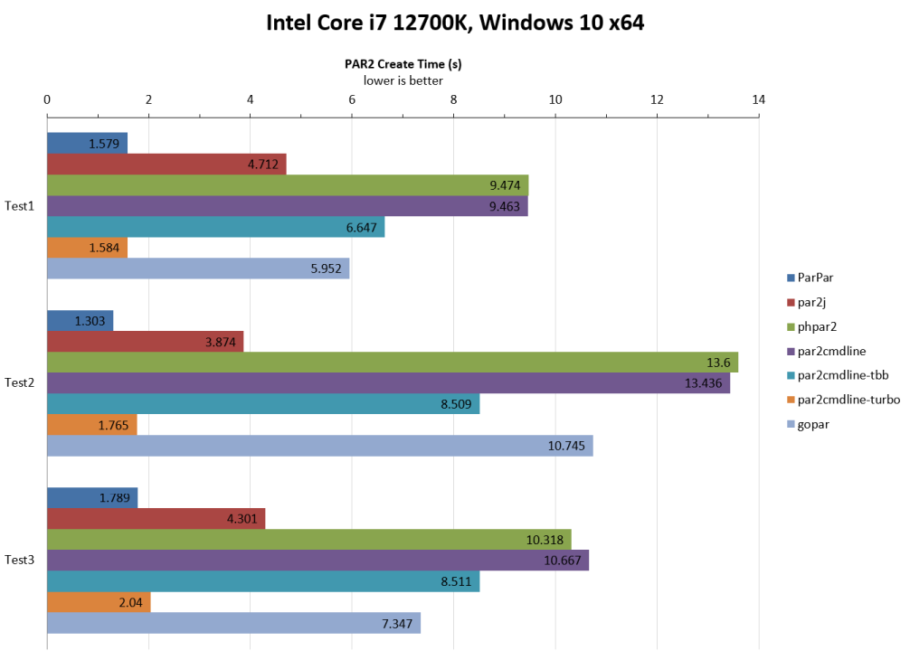

These are some non-exhaustive, non-scientific benchmarks comparisons of all the PAR2 creators I could find.

Benchmark Sets
--------------

The following scenarios were tested:

1.  1000MB file, 100 x 1M recovery slices
2.  5 x 200MB files, 200 x 512KB recovery slices
3.  1000MB file + 2 x 200MB files, 50 x 2MB recovery slices

Sample Benchmark Results
========================

Benchmark Details
=================

Applications Tested (and commands given)
----------------------------------------

-   [ParPar 0.4.0](https://animetosho.org/app/parpar) [2023-05-24]
    -   `parpar -s [blocksize]b -r [rblocks] -m 2000M -d equal -o [output] [input]`
-   [par2j from MultiPar 1.3.2.7](https://github.com/Yutaka-Sawada/MultiPar/) [2023-02-23]
    -   `par2j c -ss [blocksize] -rn [rblocks] -rf1 -in -m7 {-lc32|-lc64} [output] [input]`
-   [phpar2 1.5](http://www.paulhoule.com/phpar2/index.php) [2017-11-14]
    -   `phpar2 c -s [blocksize] -c [rblocks] -n1 -m 2000 [output] [input]`
-   [par2cmdline 0.8.1 (BlackIkeEagle’s fork)](https://github.com/Parchive/par2cmdline) [2020-02-09]
    -   `par2 c -s [blocksize] -c [rblocks] -n1 -m 2000 [output] [input]`
-   [par2cmdline-0.4-tbb-20150503](https://web.archive.org/web/20150516233245/www.chuchusoft.com/par2_tbb/download.html) [2015-05-03]
    -   `par2_tbb c -s [blocksize] -c [rblocks] -n1 -m 2000 [output] [input]`
    -   At time of writing, ChuChuSoft’s website was down. Windows binaries can be found in the [SABnzbd 0.8.0 package](https://sourceforge.net/projects/sabnzbdplus/files/), and source code [can be found here](https://github.com/jcfp/par2tbb-chuchusoft-sources/releases/)
    -   [TBB won't work on non-x86 CPUs, or older versions of Windows](https://www.threadingbuildingblocks.org/system-requirements)
-   [par2cmdline-turbo 1.0.0](https://github.com/animetosho/par2cmdline-turbo) [2023-05-24]
    -   `par2_turbo c -s [blocksize] -c [rblocks] -n1 -m 2000 [output] [input]`
    -   par2cmdline 0.8.1~0.8.2 using the ParPar 0.4.0 backend
-   [gopar](https://github.com/akalin/gopar) [2021-05-24]
    -   `gopar -g [threads] c -s [blocksize] -c [rblocks] [output].par2 [input]`
    -   Compiled using Go v1.20.4
    -   gopar seems to be a relatively simple implementation at the moment, so comparing against fully fledged clients is perhaps unfair, but is still be an interesting point of reference

### Notes

-   par2j and phpar2 are Windows only, all other applications are cross platform. On x86 Linux, these tools were run under Wine
-   pre-built binaries were used if supplied by the project
-   memory limits were generously set as possible so that it wasn’t a limiting factor. Whilst this would be nice to test, how applications decide to use memory can vary, and par2j uses a different scheme to other applications, which makes it difficult to do a fair comparison

Applications Not Tested
-----------------------

The only other complete-ish implementation of PAR2 I could find is [QuickPar](http://www.quickpar.org.uk/). This is a Windows-only GUI application which hasn't been updated since 2004, and no source code available. The application has largely be superseded by newer clients, and considering its single threaded nature, is unlikely competitive by today's standards.

Running Your Own Benchmarks
===========================

The test runner used in the above benchmarks, *bench.js*, is included here so that you can run your own tests. Note that there are a few things you need to be aware of for it to work:

-   files (input and output) will be written to the temp directory if the `TMP`     or `TEMP` environment variable is set, falling back to the current working     directory
-   executables should be placed in the current working directory
-   naming (append .exe where necessary:
    -   par2cmdline should be named **par2**
    -   par2cmdline-tbb should be named **par2_tbb**
    -   par2cmdline-turbo should be named **par2_turbo**
    -   par2j uses default EXE name **par2j** or **par2j64**; for bencmarking these on Linux, make sure wine is installed
    -   phpar2 should be named **phpar2**; on Linux, Wine is required
    -   gopar should be named **gopar**.
    -   ParPar should be named **parpar**; alternatively, **parpar.cmd** will be tried on Windows or **parpar.sh** on non-Windows. These latter options enable ParPar to be tested in source form  
        Example ParPar bash script: `nodejs _parpar/bin/parpar.js $*`  
        Example ParPar batch script: `@"%~dp0\parpar\bin\node.exe" "%~dp0\parpar\bin\parpar.js" %*`
-   results will be printed out in CSV format. I haven’t bothered with stdout/stderr differentiation, so just copy/paste the relevant data into a CSV file
-   as memory limits have been set quite high for most tests, ensure your system has enough free RAM for a fair comparison (if you need to change this, search for “2000” in the code and change to something else - note that memory cannot be adjusted with gopar, so if you don’t have enough, you may need to disable gopar benchmarks)
-   the *async* library is required (`npm install async` will get what you need)
