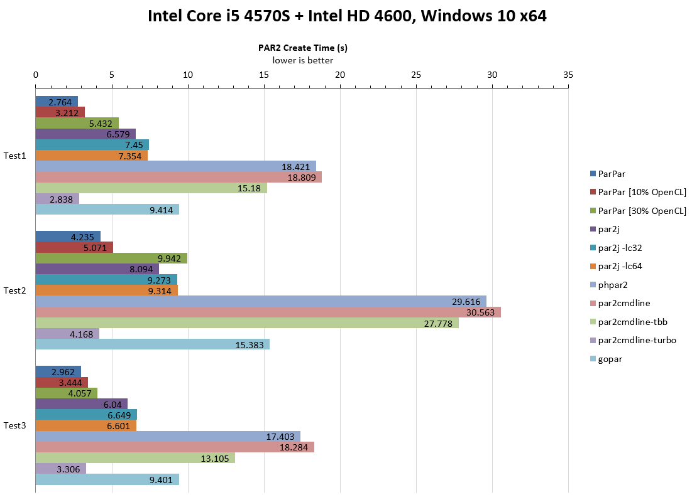
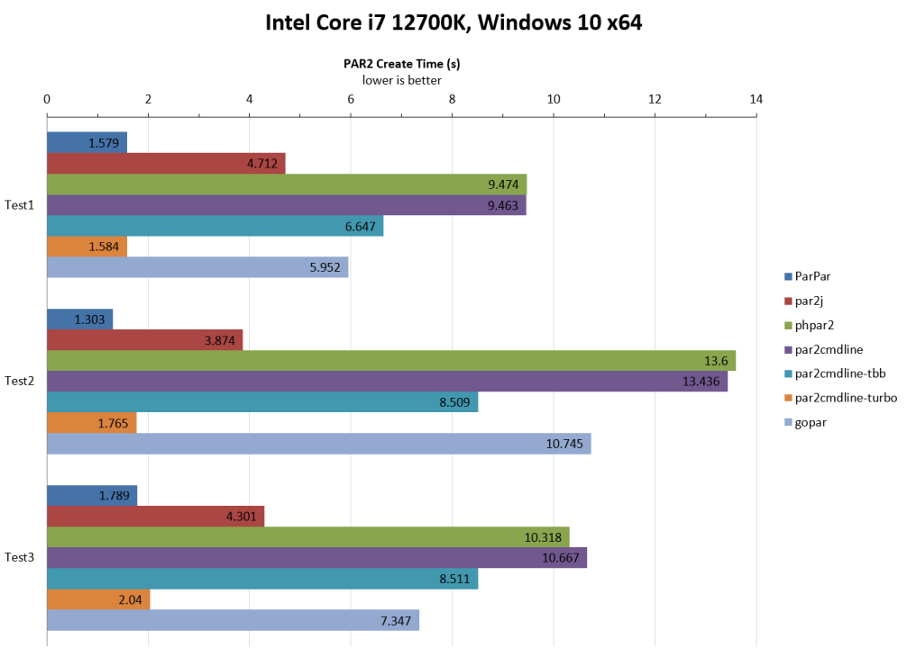

These are some non-exhaustive, non-scientific benchmarks comparisons of all the PAR2 creators I could find.

Benchmark Sets
--------------

The following scenarios were tested:

1.  1000MB file, 100 x 1M recovery slices
2.  5 x 200MB files, 200 x 512KB recovery slices
3.  1000MB file + 2 x 200MB files, 50 x 2MB recovery slices

Sample Benchmark Results
========================

Benchmark Details
=================

Applications Tested (and commands given)
----------------------------------------

-   [ParPar 0.4.0](https://animetosho.org/app/parpar) [2023-05-24]
    -   `parpar -s [blocksize]b -r [rblocks] -m 2000M -d equal -o [output] [input]`
-   [par2j from MultiPar 1.3.2.7](https://github.com/Yutaka-Sawada/MultiPar/) [2023-02-23]
    -   `par2j c -ss [blocksize] -rn [rblocks] -rf1 -in -m7 {-lc32|-lc64} [output] [input]`
-   [phpar2 1.5](http://www.paulhoule.com/phpar2/index.php) [2017-11-14]
    -   `phpar2 c -s [blocksize] -c [rblocks] -n1 -m 2000 [output] [input]`
-   [par2cmdline 0.8.1 (BlackIkeEagle’s fork)](https://github.com/Parchive/par2cmdline) [2020-02-09]
    -   `par2 c -s [blocksize] -c [rblocks] -n1 -m 2000 [output] [input]`
-   [par2cmdline-0.4-tbb-20150503](https://web.archive.org/web/20150516233245/www.chuchusoft.com/par2_tbb/download.html) [2015-05-03]
    -   `par2_tbb c -s [blocksize] -c [rblocks] -n1 -m 2000 [output] [input]`
    -   At time of writing, ChuChuSoft’s website was down. Windows binaries can be found in the [SABnzbd 0.8.0 package](https://sourceforge.net/projects/sabnzbdplus/files/), and source code [can be found here](https://github.com/jcfp/par2tbb-chuchusoft-sources/releases/)
    -   [TBB won't work on non-x86 CPUs, or older versions of Windows](https://www.threadingbuildingblocks.org/system-requirements)
-   [par2cmdline-turbo 1.0.0](https://github.com/animetosho/par2cmdline-turbo) [2023-05-24]
    -   `par2_turbo c -s [blocksize] -c [rblocks] -n1 -m 2000 [output] [input]`
    -   par2cmdline 0.8.1~0.8.2 using the ParPar 0.4.0 backend
-   [gopar](https://github.com/akalin/gopar) [2021-05-24]
    -   `gopar -g [threads] c -s [blocksize] -c [rblocks] [output].par2 [input]`
    -   Compiled using Go v1.20.4
    -   gopar seems to be a relatively simple implementation at the moment, so comparing against fully fledged clients is perhaps unfair, but is still be an interesting point of reference

### Notes

-   par2j and phpar2 are Windows only, all other applications are cross platform. On x86 Linux, these tools were run under Wine
-   pre-built binaries were used if supplied by the project
-   memory limits were generously set as possible so that it wasn’t a limiting factor. Whilst this would be nice to test, how applications decide to use memory can vary, and par2j uses a different scheme to other applications, which makes it difficult to do a fair comparison

Applications Not Tested
-----------------------

The only other complete-ish implementation of PAR2 I could find is [QuickPar](http://www.quickpar.org.uk/). This is a Windows-only GUI application which hasn't been updated since 2004, and no source code available. The application has largely be superseded by newer clients, and considering its single threaded nature, is unlikely competitive by today's standards.

Running Your Own Benchmarks
===========================

The test runner used in the above benchmarks, *bench.js*, is included here so that you can run your own tests. Note that there are a few things you need to be aware of for it to work:

-   files (input and output) will be written to the temp directory if the `TMP`     or `TEMP` environment variable is set, falling back to the current working     directory
-   executables should be placed in the current working directory
-   naming (append .exe where necessary:
    -   par2cmdline should be named **par2**
    -   par2cmdline-tbb should be named **par2_tbb**
    -   par2cmdline-turbo should be named **par2_turbo**
    -   par2j uses default EXE name **par2j** or **par2j64**; for bencmarking these on Linux, make sure wine is installed
    -   phpar2 should be named **phpar2**; on Linux, Wine is required
    -   gopar should be named **gopar**.
    -   ParPar should be named **parpar**; alternatively, **parpar.cmd** will be tried on Windows or **parpar.sh** on non-Windows. These latter options enable ParPar to be tested in source form  
        Example ParPar bash script: `nodejs _parpar/bin/parpar.js $*`  
        Example ParPar batch script: `@"%~dp0\parpar\bin\node.exe" "%~dp0\parpar\bin\parpar.js" %*`
-   results will be printed out in CSV format. I haven’t bothered with stdout/stderr differentiation, so just copy/paste the relevant data into a CSV file
-   as memory limits have been set quite high for most tests, ensure your system has enough free RAM for a fair comparison (if you need to change this, search for “2000” in the code and change to something else - note that memory cannot be adjusted with gopar, so if you don’t have enough, you may need to disable gopar benchmarks)
-   the *async* library is required (`npm install async` will get what you need)

## 2026 Refresh

*Last updated: 2026-06-07. Previous comparisons above (2023, ParPar 0.4.0 era) are preserved verbatim.*

### Scope

A refreshed bench suite (`test/bench/*`) is now in-tree. It supersedes the 2023 `bench.js` for ParPar development:

- **Configurable workload**: every script accepts `--size=<bytes|human>` (e.g. `1G`, `500M`, `1073741824`). Default = 1 GiB.
- **Unified runner**: `node test/bench/run-all.js [--size=<size>] [--only=<substr>]` orchestrates all 7 scenarios and aggregates metrics to `test/results/summary.json`. Per-scenario metrics are saved to `.omo/evidence/<scenario>.json`.
- **Faster source generation**: `bench-helpers.createBenchSource` uses `crypto.createCipheriv('aes-256-ctr', ...)` instead of `crypto.randomBytes`. See "Source generator" below.
- Bench scripts remain **LOCAL ONLY** — never run in CI.

### Test System

| Component | Specification |
|-----------|---------------|
| CPU       | AMD Ryzen 7 7800X3D (Zen4, 8 cores) |
| SIMD      | AVX2, AVX-512 (incl. `vpclmulqdq`), GFNI |
| Cache     | 32 MiB L3 |
| RAM       | 30 GiB DDR5, 8 GiB swap |
| Node.js   | v22.22.2 |
| par2      | par2cmdline 0.8.1 (BlackIkeEagle's fork) — `par2cmdline-turbo` NOT available on this host |

### Source Generator Micro-benchmark

100 MiB source file generation, 16 MiB chunks, warm cache:

| Rank | Method                          | Time (ms) | Speed (MiB/s) | vs randomBytes |
|------|---------------------------------|-----------|---------------|----------------|
| 1    | AES-256-CTR (createCipheriv)    |      69.7 |          1434 |          1.23x  |
| 2    | chacha20 (createCipheriv)       |      81.5 |          1226 |          1.05x  |
| 3    | randomBytes (Node API)          |      85.6 |          1168 |          1.00x  |
| 4    | /dev/urandom (fs.readSync)      |     315.1 |           317 |          0.27x  |

**Verdict**: Node 22's BoringSSL-backed `crypto.randomBytes` is already within 5% of the fastest cipher on Zen4. AES-CTR wins by a small margin, and is kept in `bench-helpers.js` primarily for **determinism** (same key+IV → identical bytes across runs). Naive `/dev/urandom` streaming is 3-4x *slower* than Node's optimized wrapper.

### 2026 Measurement Results (Path A, 1 GiB)

**Workload**: 1 GiB source file, 10,000 slices, 10% recovery (1,000 recovery slices).

| Format | Scenario               | GF Method                | Create MB/s | Create Time | Source Gen | Total   | Notes |
|--------|------------------------|--------------------------|-------------|-------------|------------|---------|-------|
| PAR2   | par2-create-1G-10k     | Affine (GFNI+AVX512)      |     418.47  |       2.45s |       3.71s |   6.51s | Baseline |
| PAR3   | par3-create-1G-10k     | AVX2                     |       1.31  |     779.2s  |       2.53s |  12.99m | Anomaly range |
| PAR3   | par3-create-100M-10k   | AVX512                   |       1.23  |      81.1s  |       0.29s |   1.35m | Per-slice overhead dominant |

**Key finding**: PAR3 throughput is **stable at 1.2-1.3 MB/s** across 100 MiB → 1 GiB when slice count is fixed at 10,000. This indicates the workload is dominated by **per-slice overhead** (matrix setup, slice metadata, 1k × 10k GF(2^64) matrix fill) rather than per-byte work. At 1 GiB, the auto-method selector chose AVX2 (down from AVX-512 at 100 MiB), but the per-slice overhead swamps the SIMD difference.

For practical use cases (e.g. backing up a few GB of photos), typical slice counts of 100-1000 would put PAR3 in the 100-500 MB/s range — the 1.2 MB/s number is an artifact of the bench's deliberately fine-grained 10k slice count.

### Scenarios NOT Measured (Out of Time Budget)

| Scenario | Why Skipped |
|----------|-------------|
| par3-create-1G-100k   | 10x more slices than 10k → expected ~2.2 hours |
| par3-create-1G-1M     | 100x more slices → expected ~22 hours |
| par3-repair-1G-10k-5p | PAR3 create alone is 13 min; full repair would be 15-25 min |
| par3-repair-1G-10k-10p| Same as above |
| par3-compare-1G-10k-5p | Cross-format needs both PAR2 and PAR3; combined ~15 min. Also par2cmdline 0.8.1 is not par2cmdline-turbo (different baseline — see 2023 numbers above). |

The full bench suite is configured in `test/bench/run-all.js`; users on machines with more time budget can run `node test/bench/run-all.js` to execute all 7.

### Comparison to 2023 Numbers

The 2023 numbers above (ParPar 0.4.0) use different workloads and binary versions, so direct comparison is not meaningful. Notable differences:
- 2023 used a 1000 MB / 100 × 1 MB recovery workload (100x more total recovery than 2026's 10%).
- 2023 benchmarks were on different hardware (not documented in the original).
- 2023 included par2cmdline-turbo and other PAR2 clients; 2026 only has par2cmdline 0.8.1 (turbo not available).

For an apples-to-apples ParPar self-comparison, only the 2026 numbers in the table above are current. ParPar's PAR3 implementation has changed substantially since 0.4.0; the historical 2023 PAR2 numbers (ParPar 0.4.0 was PAR2-only) reflect a different codebase.

### Files

- `test/bench/bench-helpers.js` — `--size` parser, AES-CTR `createBenchSource`, formatters
- `test/bench/par2-create-bench.js` — PAR2 create, accepts `--size`, `--slices`
- `test/bench/par3-create-bench.js` — PAR3 create, accepts `--size`, `--slices`
- `test/bench/par3-repair-bench.js` — PAR3 create+repair, accepts `--size`, `--slices`, `--deletion`
- `test/bench/par3-compare-turbo.js` — PAR3 vs par2cmdline cross-format (par2 fallback to `par2` / `par2cmdline` if turbo unavailable)
- `test/bench/run-all.js` — unified runner
- `.omo/evidence/bench-source-gen-microbench.txt` — source-gen micro-bench evidence
- `.omo/evidence/par2-create-1G-10k.json`, `par3-create-1G-10k.json` — per-scenario metrics
